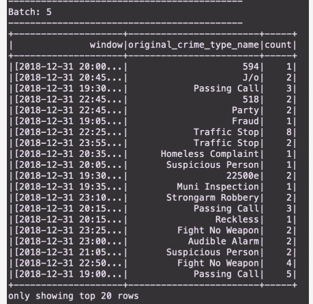

# SF-CRIME-STATISTICS-WITH-SPARK-STREAMING

In this project, We make use of real world dataset from the kaggle repositories on the San francisco crime incidents to perform statistical analysis of the data using Apache spark structured streaming.  
We create a kafka server to produce and ingest the data. 

## Requirements
- Spark 2.4.3
- Scala 2.11.x
- Java 1.8.x
- Kafka build with Scala 2.11.x
- Python 3.6.x or 3.7.xies

## Setup procedure

- Download Spark from https://spark.apache.org/downloads.html. Choose Prebuilt for Apache Hadoop 2.7 and later
- Unpack Spark in one of your folders. 
- Download Scala from the official site or for Mac users, you can also use brew install scala but make sure you download version 2.11.x
- Make sure your ~/.bash_profile looks like below (might be different based on your directory):

 ` export SPARK_HOME=/Users/dev/spark-2.3.0-bin-hadoop2.7`

 ` export JAVA_HOME=/Library/Java/JavaVirtualMachines/jdk1.8.0_181.jdk/Contents/Home`
  
 ` export SCALA_HOME=/usr/local/scala/`
  
 ` export PATH=$JAVA_HOME/bin:$SPARK_HOME/bin:$SCALA_HOME/bin:$PATH`
 
  
## Project process

This project requires creating topics, starting Zookeeper and Kafka server, and your Kafka bootstrap server. 
Use the commands below to start Zookeeper and Kafka server.

` bin/zookeeper-server-start.sh config/zookeeper.properties`

` bin/kafka-server-start.sh config/server.properties`

We download the data in CSV format from the kaggle repository [here](https://www.kaggle.com/san-francisco/sf-police-calls-for-service-and-incidents/version/61)
This data (police-department-calls-for-service.csv) is over 400Mb and too bulky to run our work on, so we focus on the first 700 list of data. 
This data is converted to `json` format and inserted into the `producer_server.py` file. In said file, we encode the json file and start up the kafka client using `client = pykafka.KafkaClient("localhost:9092")` on  line 39. 

- We start the server by runnning the Python command: 

`python producer_server.py`

- Check if the server is correctly implemented by running the command;

` bin/kafka-console-consumer.sh --bootstrap-server localhost:9092 --topic <your-topic-name> --from-beginning`

- upon completing the `consumer.py` file, we run it and get the following output: 

- Next we complete the `data_stream.py` file, we start by creating a schema for our incoming data. From line 39 we can see how the spark job is configured. To get the required output; using the `window` function, we get a count of the distincted types of crimes in a 60 minuite interval and finally wirte the output. This section is completed by creating our spark in local mode. 

- To obtain the results, we do a spark-submit using this command: 

` spark-submit --packages org.apache.spark:spark-sql-kafka-0-10_2.11:2.3.0 --master local[4] data_stream.py`

